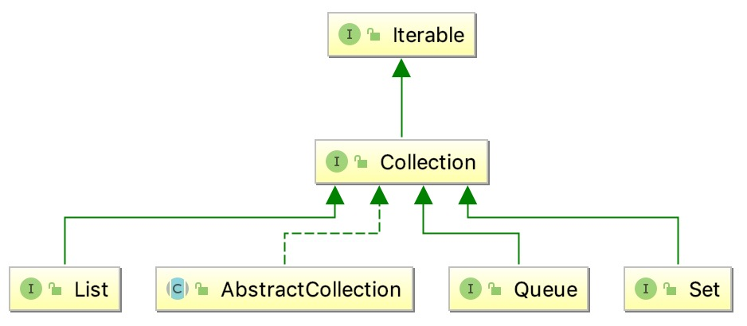

<!-- TOC -->

- [概览](#%E6%A6%82%E8%A7%88)
  - [1. method](#1-method)
    - [1.1 size()](#11-size)
    - [isEmpty()](#isempty)
    - [contains(Object o)](#containsobject-o)
  - [2. 基于Collection的接口](#2-%E5%9F%BA%E4%BA%8Ecollection%E7%9A%84%E6%8E%A5%E5%8F%A3)
    - [2.1 List](#21-list)
    - [2.2 Queue](#22-queue)
    - [2.3 Set](#23-set)
    - [2.4 AbstractCollection](#24-abstractcollection)

<!-- /TOC -->

# 概览



集合结构的根接口。一个集合表示一组对象。一些集合允许重复数据，而另外一些集合并不允许。有些是有序的，有些是无序的。JDK不提供集合的任何实现，他提供了更具体的子接口去实现，比如 Set、List等。此接口通常用于传递集合并在需要最大通用性的情况下对其进行操作。

## 1. method

### 1.1 size()

返回Collections中的元素个数，如果元素个数大于Integer.MAX_VALUE,那么直接返回Integer.MAX_VALUE

```bash
int size();
```

### isEmpty()

如果Collection中没有元素，返回true

```bash
boolean isEmpty();
```

### contains(Object o)

如果Collections中包含指定对象

```bash
contains(Object o);
```

……

## 2. 基于Collection的接口

### 2.1 List

### 2.2 Queue

### 2.3 Set

### 2.4 AbstractCollection