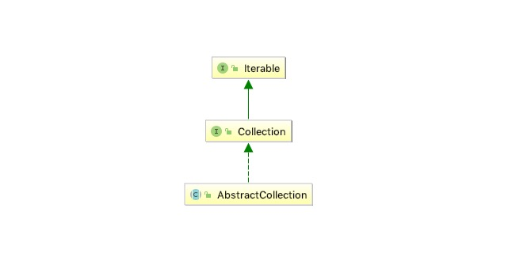

# 概览

<pre>
此类提供了Collection接口的核心实现，以减少子类的实现工作量
要实现不可修改的集合，程序员只需要扩展此类并提供迭代器和大小方法的实现。
要实现可修改的集合，程序员必须另外覆盖此类的add方法（否则会抛出UnsupportedOperationException）
迭代器方法返回的迭代器必须另外实现其remove方法。
程序员通常应该根据Collection接口规范中的建议提供void（无参数）和Collection构造函数。
此类中每个非抽象方法的文档详细描述了它的实现。 如果正在实施的集合允许更有效的实现，则可以覆盖这些方法中的每一个。
</pre>

## 1 继承的类图

* 此类实现的类图如下:

## 2 方法解读

* add() 默认返回不支持操作，这用于创建不可变Collections
* addAll() 此实现迭代指定的集合，并依次将迭代器返回的每个对象添加到此集合中。不变性由add()方法保证
* remove() 
> 此实现遍历集合以查找指定的元素。 如果找到该元素，它将使用迭代器的remove方法从集合中删除该元素。
> 请注意，如果此集合的迭代器方法返回的迭代器未实现remove方法且此集合包含指定的对象，则此实现将抛出 UnsupportedOperationException。这用于保证列表的不可变
* removeAll() 使用迭代器删除所有的数据，不性由remove方法提供保证
……