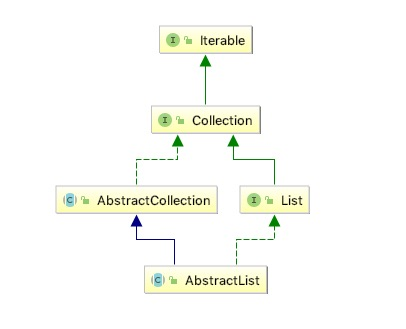

# 概览

<pre>
此类提供{@link List}接口的骨干实现，以最大限度地减少实现由“随机访问”数据存储（例如数组）支持的此接口所需的工作量。对于顺序访问数据（例如链接列表），应优先使用{@link AbstractSequentialList}，而不是此类。
要实现不可修改的列表，程序员只需要扩展此类并提供{@link #get（int）}和{@link List＃size（）size（）}方法的实现。
要实现可修改的列表，必须另外覆盖{@link #set（int，Object）set（int，E）}方法（否则会抛出{@code UnsupportedOperationException}）。如果列表是可变大小的，则程序员必须另外覆盖{@link #add（int，Object）add（int，E）}和{@link #remove（int）}方法。
程序员通常应根据{@link Collection}接口规范中的建议提供void（无参数）和集合构造函数。
与其他抽象集合实现不同，程序员不必提供迭代器实现; 迭代器和列表迭代器由随机访问接口实现，方法：
{@link #get（int）}，
{@link #set（int，Object）set（int，E）}，
{@link #add（int，Object）add（int，E）}和
{@link #remove（int）}。
此类中每个非抽象方法的文档详细描述了它的实现。 如果正在实施的集合允许更有效的实现，则可以覆盖这些方法中的每一个。
</pre>

## 1 结构类图

