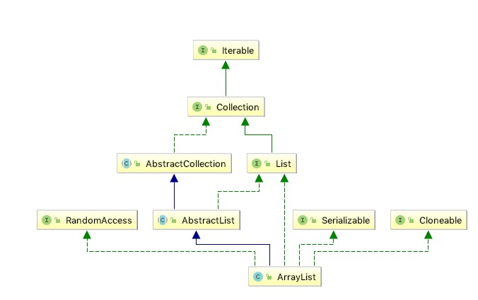

# 概览

## 1 总体解说

<pre>
List接口的可调整大小的数组实现。实现所有可选列表操作，并允许所有元素，包括null。除了实现List接口之外，此类还提供了一些方法来操作内部用于存储列表的数组的大小。(这个类大致相当于Vector，除了它是不同步的。）
size，isEmpty，get，set，iterator和listIterator操作以恒定时间运行。添加操作以分摊的常量时间运行，即添加n个元素需要O（n）时间。所有其他操作都以线性时间运行（粗略地说）。与LinkedList实现相比，常数因子较低。
每个ArrayList实例都有一个容量。容量是用于存储列表中元素的数组的大小。它始终至少与列表大小一样大。当元素添加到ArrayList时，其容量会自动增加
应用程序可以在使用ensureCapacity操作添加大量元素之前增加ArrayList实例的容量。这可能会减少增量重新分配的数量。
请注意，此实现不同步。如果多个线程同时访问ArrayList实例，并且至少有一个线程在结构上修改了列表，则必须在外部进行同步。 （结构修改是添加或删除一个或多个元素的任何操作，或显式调整后备数组的大小;仅设置元素的值不是结构修改。）这通常通过同步一些封装的对象来实现
也可以使用{@link Collections＃synchronizedList Collections.synchronizedList}方法“包装”该列表。这最好在创建时完成，以防止意外地不同步访问列表： List list = Collections.synchronizedList（new ArrayList（...））;
此类的{@link #iterator（）iterator}和{@link #listIterator（int）listIterator}方法返回的迭代器是快速失败的：如果在创建迭代器后的任何时候对列表进行结构修改，则以任何方式除了通过迭代器自己的{@link ListIterator #remove（）remove}或{@link ListIterator #add（Object）add}方法之外，迭代器将抛出{@link ConcurrentModificationException}。因此，在并发修改的情况下，迭代器快速而干净地失败，而不是在未来的未确定时间冒任意，非确定性行为的风险。
请注意，迭代器的快速失败行为无法得到保证，因为一般来说，在存在非同步并发修改的情况下，无法做出任何硬性保证。 失败快速的迭代器会尽最大努力抛出{@code ConcurrentModificationException}。 因此，编写依赖于此异常的程序以确保其正确性是错误的：迭代器的快速失败行为应该仅用于检测错误。
</pre>

## 2 关于扩容

当插入数据时，首先要检查容量，如果容量不够需要扩容，扩容当前的系数是1.5。默认的库容是10

## 3 属性

* DEFAULT_CAPACITY 默认值10
* DEFAULTCAPACITY_EMPTY_ELEMENTDATA 用于查看是否为空数组，如果为空则初始化容量为10
* elementData 真正存储数据的地方
* EMPTY_ELEMENTDATA 共享的创建空数组的返回值
* MAX_ARRAY_SIZE 最大的容量值，Integer.MAX_VALUE - 8;一些VM在阵列中保留一些标题字。尝试分配更大的数组可能会导致OutOfMemoryError：请求的数组大小超过VM限制
* serialVersionUID
* size

## 4. add(int index, E element)

指定位置插入，在插入之前先要对位置之前的数据进行拷贝，这是比较费性能的