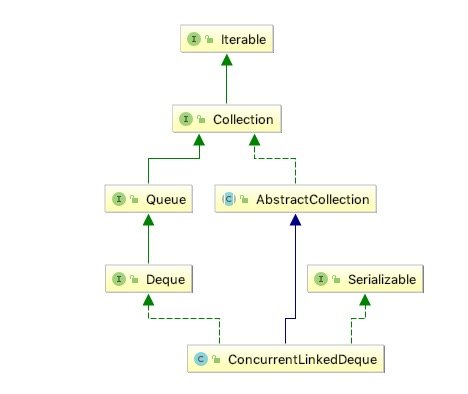

# 概览

## 1.总体介绍

<pre>
基于链接节点的无界并发{@linkplain Deque deque}。并发插入，删除和访问操作可跨多个线程安全执行。当许多线程共享对公共集合的访问权时，{@code ConcurrentLinkedDeque}是一个合适的选择。与大多数其他并发集合实现一样，此类不允许使用{@code null}元素。
迭代器和分裂器是弱一致
请注意，与大多数集合不同，size方法不是一个恒定时间操作。由于这些deques的异步性质，确定元素的当前数量需要遍历元素，因此如果在遍历期间修改此集合，则可能报告不准确的结果。此外，批量操作 addAll，removeAll，retainAll，containsAll，equals和toArray不保证以原子方式执行。例如，与{@code addAll}操作同时运行的迭代器可能只查看一些添加的元素。
该类及其迭代器实现了{@link Deque}和{@link Iterator}接口的所有可选方法。
</pre>