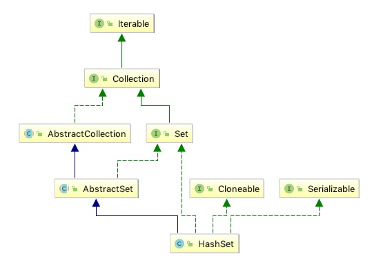

# 概览

## 1 总体说明

<pre>
此类实现Set接口，由哈希表（实际上是HashMap实例）支持。它不能保证集合的迭代顺序;特别是，它不保证订单会随着时间的推移保持不变。该类允null元素。
此类为基本操作提供恒定的时间性能，时间复杂度为O(1)（添加，删除，包含和size），假设散列函数在桶之间正确地分散元素。迭代此集合需要的时间与HashSet实例的大小（元素数量）加上后缀HashMap实例的“容量”（桶数）成正比）。因此，如果迭代性能很重要，则不要将初始容量设置得太高（或负载因子太低）非常重要。
请注意，此实现未同步。如果多个线程同时访问哈希集，并且至少有一个线程修改了该集，则必须在外部进行同步。这通常通过在自然封装集合的某个对象上进行同步来实现。
如果需要线程安全的对象，可以考虑使用{@link Collections＃synchronizedSet Collections.synchronizedSet}方法“包装”该集合。这最好在创建时完成，以防止意外地不同步访问set：Set s = Collections.synchronizedSet（new HashSet（...））
此类支持iterable的fall-fast策略，请注意，迭代器的快速失败行为无法得到保证，因为一般来说，在存在非同步并发修改的情况下，无法做出任何硬性保证。 失败快速迭代器会尽最大努力抛出ConcurrentModificationException。因此，编写依赖于此异常的程序以确保其正确性是错误的：迭代器的故障快速行为应仅用于检测错误。
</pre>

## 2 容器说明

HashMap为此类提供存储容器，以及Hash算法
