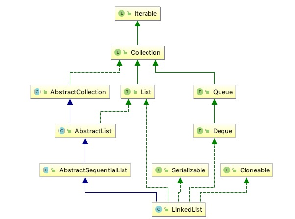

# 概览 

## 1 总体解说

<pre>
{@code List}和{@code Deque}接口的双链表实现。实现所有可选列表操作，并允许所有元素（包括{@code null}）。
对于双向链表，所有操作都可以预期。索引到列表中的操作将从开头或结尾遍历列表，以较接近指定索引为准。
此实现不具备同步的条件
如果多个线程同时访问链表，并且至少有一个线程在结构上修改了列表，则必须在外部进行同步。 （结构修改是添加或删除一个或多个元素的任何操作;仅设置元素的值不是结构修改。）这通常通过同步自然封装列表的某个对象来完成。
也可以使用{@link Collections＃synchronizedList Collections.synchronizedList}方法“包装”该列表。这最好在创建时完成，以防止意外地不同步访问列表：List list = Collections.synchronizedList（new LinkedList（...））;
这个类的itertor采用fall-fast的策略，如果在循环过程中有线程修改了对象，那么立马失败
请注意，迭代器的故障快速行为无法得到保证，因为一般来说，在存在不同步的并发修改时，不可能做出任何硬性保证。 失败快速的迭代器会尽最大努力抛出{@code ConcurrentModificationException}。 因此，编写依赖于此异常的程序以确保其正确性是错误的：迭代器的快速失败行为应该仅用于检测错误。
</pre>

## 2 Node

Node是个内部类，是LinkedList中的数据真正存放的结构。

* item  真正的数据
* next 下一个节点
* prev 上一个节点