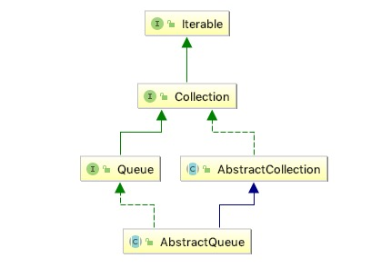

# 概览

<pre>
该类提供了一些{@link Queue}操作的骨架实现。 当基本实现不允许null元素时，此类中的实现是适当的。 方法{@link #add add}，{@ link #remove remove}和{@link #element element}基于{@link #offer offer}，{@ link #poll poll}和{@link #peek peek}，但分别抛出异常，而不是通过false或null返回指示失败。

扩展此类的Queue实现必须最低限度地定义一个方法{@link Queue＃offer}，它不允许插入null元素以及方法{@ link Queue＃peek}，{@ link Queue＃poll}，{@ link Collection＃size}和{@link Collection＃iterator}。 通常，还会覆盖其他方法。 如果无法满足这些要求，请考虑继承{@link AbstractCollection}。
</pre>