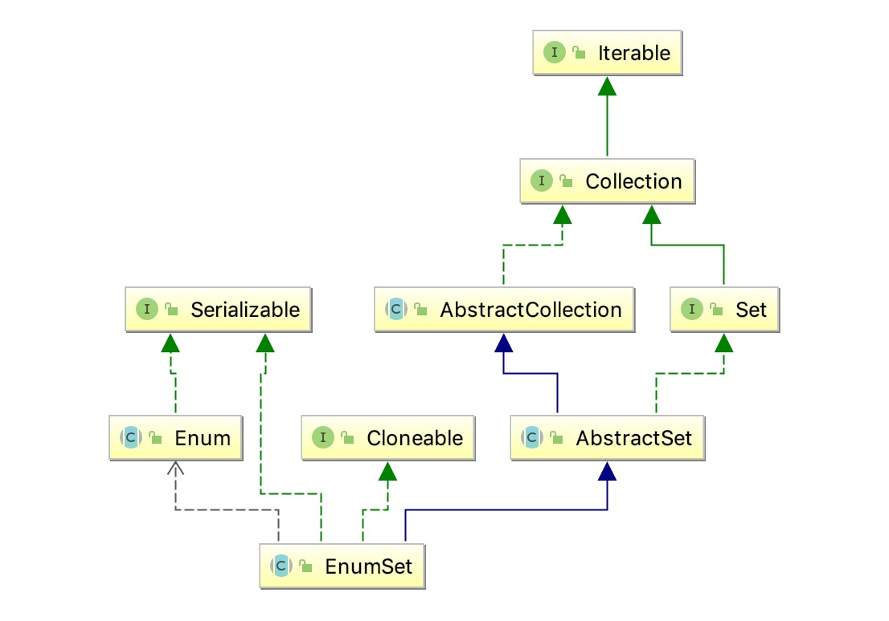

# 概览

## 1 总体说明

<pre>
用于枚举类型的专用{@link Set}实现。枚举集中的所有元素必须来自单个枚举类型，该类型在创建集时显式或隐式指定。枚举集在内部表示为位向量。这种表现非常紧凑和高效。这个类的空间和时间性能应该足以使其成为传统的基于int的“位标志”的高质量，类型安全的替代品。即使批量操作（例如containsAll和retainAll），如果它们的参数也是枚举集，也应该非常快速地运行。
</pre>