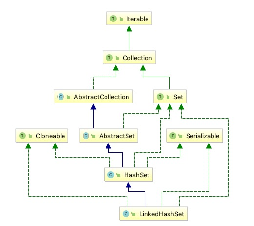

# 概览

## 总体说明

<pre>
Set接口的哈希表和链表实现，具有可预测的迭代顺序。此实现与HashSet的不同之处在于它维护了一个贯穿其所有条目的双向链表。此链接列表定义迭代排序，即元素插入集合（插入顺序）的顺序。请注意，如果元素重新插入，则插入顺序不会受到影响。 （如果在s.contains（e）中调用s.add（e），则将元素e重新插入到集合s中会在调用之前立即返回true。）
此实现使客户端免受{@link HashSet}提供的未指定的，通常混乱的排序，而不会导致与{@link TreeSet}相关的成本增加。无论原始集的实现如何，它都可用于生成与原始集具有相同顺序的集的副本
此接口允许Null，时间复杂度为O(1)
请注意，此实现未同步。支持fall-fast策略
</pre>