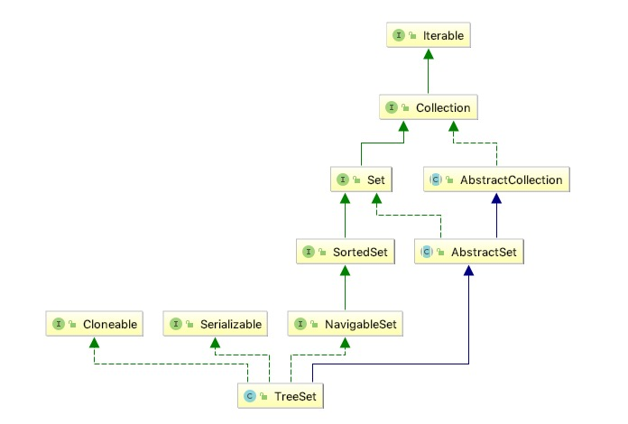

# 概览

## 1 总体说明

* TreeSet 实现了SortedSet和NavigableSet接口，所以具备排序的功能

基于{@link TreeMap}的{@link NavigableSet}实现。元素按照{@linkplain Comparable natural ordering}或在创建时创建的{@link Comparator}进行排序，具体取决于使用的构造函数。
此实现为基本操作（{@code add}，{@ code remove}和{@code contains}）提供了有保证的log（n）时间成本。
请注意，如果要正确实现{@code Set}接口，则由集合维护的排序（无论是否提供显式比较器）必须与equals一致。
请注意，此实现未同步。如果需要同步，则应使用{@link Collections＃synchronizedSortedSet Collections.synchronizedSortedSet}方法“包装”该集合。这最好在创建时完成，以防止意外的不同步访问集：SortedSet s = Collections.synchronizedSortedSet（new TreeSet（...））
此类支持fall-fast策略

## 2 存储说明

NavigableMap 实例提供存储保证和顺序