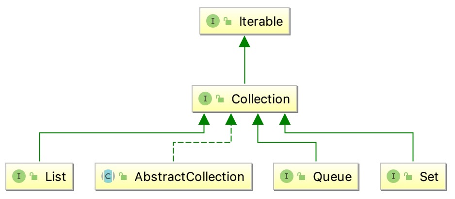

<!-- TOC -->

- [概览](#%E6%A6%82%E8%A7%88)
  - [1. method](#1-method)
    - [1.1 size()](#11-size)
    - [isEmpty()](#isempty)
    - [contains(Object o)](#containsobject-o)
  - [2. 基于Collection的接口](#2-%E5%9F%BA%E4%BA%8Ecollection%E7%9A%84%E6%8E%A5%E5%8F%A3)
    - [2.1 List](#21-list)
      - [2.1.1 StringList](#211-stringlist)
      - [2.1.2 ByteList](#212-bytelist)
      - [2.1.3 ShortList](#213-shortlist)
      - [2.1.4 ObjectList](#214-objectlist)
    - [2.2 Queue](#22-queue)
      - [2.2.1 BlockingQueue](#221-blockingqueue)
        - [2.2.1.1 TransferQueue](#2211-transferqueue)
        - [2.2.1.2 BlockingDeque](#2212-blockingdeque)
      - [2.2.2 Deque](#222-deque)
    - [2.3 Set](#23-set)
      - [2.3.1 SortedSet](#231-sortedset)
      - [2.3.2 NavigableSet](#232-navigableset)

<!-- /TOC -->

# 概览



集合结构的根接口。一个集合表示一组对象。一些集合允许重复数据，而另外一些集合并不允许。有些是有序的，有些是无序的。JDK不提供集合的任何实现，他提供了更具体的子接口去实现，比如 Set、List等。此接口通常用于传递集合并在需要最大通用性的情况下对其进行操作。

## 1. method

### 1.1 size()

返回Collections中的元素个数，如果元素个数大于Integer.MAX_VALUE,那么直接返回Integer.MAX_VALUE

```bash
int size();
```

### isEmpty()

如果Collection中没有元素，返回true

```bash
boolean isEmpty();
```

### contains(Object o)

如果Collections中包含指定对象

```bash
contains(Object o);
```

……

## 2. 基于Collection的接口

### 2.1 List

<pre>
有序集合，又叫序列。 该接口的用户可以精确控制列表中每个元素的插入位置。 用户可以通过整数索引访问元素，并搜索列表中的元素。
与set不同，列表通常允许重复元素。 更正式地，列表通常允许元素对e1和e2，使得e1.equals(e2)，并且它们通常允许多个空元素，如果 它们允许空元素。 有人可能希望通过在用户尝试插入运行时异常时抛出运行时异常来实现禁止重复的列表并不是不可思议，但我们希望这种用法很少见。
List接口在Collection接口中指定的其他规定上添加iterator的合同，add，delete，equal和hashCode方法。 为方便起见，此处还包括其他继承方法的声明。
List接口提供了四种对列表元素进行位置（索引）访问的方法。列表（如Java数组）基于零。请注意，对于某些实现（例如LinkedList 类），这些操作可以与索引值成比例地执行。因此，如果调用者不知道实现，则迭代遍历列表中的元素通常比通过它进行索引更好。<p>
</pre>

#### 2.1.1 StringList

StringList是GenericString的不可变有序集合

#### 2.1.2 ByteList

ByteList是byte的不可变有序集合

#### 2.1.3 ShortList

ShortList是unsigned int的不可变有序集合

#### 2.1.4 ObjectList

ObjectList是Object的不可变有序集合

### 2.2 Queue

<pre>
Queue通常（但不一定）以FIFO（先进先出）方式对元素进行排序。例外的是优先级队列，它根据提供的比较器对元素进行排序，或者元素的自然排序，以及LIFO队列（或堆栈），它们对元素LIFO（后进先出）进行排序。

无论使用什么顺序，队列的head都是通过调用{@link #remove（）}或{@link #poll（）}删除的元素。在FIFO队列中，所有新元素都插入队列的tail。其他类型的队列可能使用不同的放置规则。每个{@code Queue}实现都必须指定其排序属性。

无论使用什么顺序，队列的head都是通过调用{@link #remove（）}或{@link #poll（）}删除的元素。在FIFO队列中，所有新元素都插入队列的tail。其他类型的队列可能使用不同的放置规则。每个{@code Queue}实现都必须指定其排序属性。

{@link #remove()}和{@link #pol()}方法删除并返回队列的头部。确切地说，从队列中删除了哪个元素是队列的排序策略的功能，它不同于实施到实施。 {@code remove()}和{@code poll()}方法的区别仅在于队列为空时的行为：{@code remove()}方法抛出异常，而{@code poll()}方法返回{@code null}。

{@link #element（）}和{@link #peek（）}方法返回，但不删除队列的头部。

{@code Queue}接口未定义在并发编程中很常见的阻塞队列方法。这些等待元素出现或空间可用的方法在{@link java.util.concurrent.BlockingQueue}接口中定义，该接口扩展了此接口。

 {@code Queue}实现通常不允许插入{@code null}元素，尽管某些实现（例如{@link LinkedList}）允许插入{@code null}。 即使在允许它的实现中，也不应将{@code null}插入{@code Queue}，因为{@code null}也被{@code poll}方法用作特殊返回值以指示队列不包含任何元素。
</pre>

#### 2.2.1 BlockingQueue

<pre>
{@ code BlockingQueue}方法有四种形式，有不同的处理操作的方式，不能立即满足，但可能在将来的某个时候得到满足：一个抛出异常，第二个返回一个特殊值（或者 {@code null}或{@code false}，取决于操作），第三个会无限期地阻塞当前线程，直到操作成功，并且第四个块在放弃之前仅限于给定的最大时间限制。 这些方法总结在下表中：
</pre>

<table BORDER CELLPADDING=3 CELLSPACING=1>
  <caption>Summary of BlockingQueue methods</caption>
  <tr>
     <td></td>
     <td ALIGN=CENTER><em>Throws exception</em></td>
     <td ALIGN=CENTER><em>Special value</em></td>
     <td ALIGN=CENTER><em>Blocks</em></td>
     <td ALIGN=CENTER><em>Times out</em></td>
   </tr>
   <tr>
     <td><b>Insert</b></td>
     <td>{@link #add add(e)}</td>
     <td>{@link #offer offer(e)}</td>
     <td>{@link #put put(e)}</td>
     <td>{@link #offer(Object, long, TimeUnit) offer(e, time, unit)}</td>
   </tr>
   <tr>
     <td><b>Remove</b></td>
     <td>{@link #remove remove()}</td>
     <td>{@link #poll poll()}</td>
     <td>{@link #take take()}</td>
     <td>{@link #poll(long, TimeUnit) poll(time, unit)}</td>
   </tr>
   <tr>
     <td><b>Examine</b></td>
     <td>{@link #element element()}</td>
     <td>{@link #peek peek()}</td>
     <td><em>not applicable</em></td>
     <td><em>not applicable</em></td>
   </tr>
</table>

<pre>
BlockQueue不允许插入null，因为null用作容器中没有数据时候返回的标志位

{@code BlockingQueue}可能是容量限制的。 在任何给定时间它可能具有{@code remainingCapacity}，超过该值就不会有{@code put}而不会阻塞。 没有任何内在容量限制的{@code BlockingQueue}始终报告{@code Integer.MAX_VALUE}的剩余容量

BlockQueue通常用作阻塞队列，当然也实现了Collection接口，所以也可以通过索引删除数据但是不建议这么干

{@code BlockingQueue}实现是线程安全的。 所有排队方法都使用内部锁或其他形式的并发控制以原子方式实现其效果。 但是，<em>批量</em>收集操作{@code addAll}，{@ code containsAll}，{@code retainAll}和{@code removeAll} <em>不</ em>必须以原子方式执行，除非指定 否则在实施中。 因此，例如，{@ code addAll（c）}在仅添加{@code c}中的一些元素后失败（抛出异常）是可能的。
</pre>

##### 2.2.1.1 TransferQueue

<pre>
TransferQueue则更进一步，生产者会一直阻塞直到所添加到队列的元素被某一个消费者所消费（不仅仅是添加到队列里就完事）。新添加的transfer方法用来实现这种约束。顾名思义，阻塞就是发生在元素从一个线程transfer到另一个线程的过程中，它有效地实现了元素在线程之间的传递（以建立Java内存模型中的happens-before关系的方式）。
</pre>

##### 2.2.1.2 BlockingDeque

<pre>
BlockingDeque 是java.util.concurrent包中的一个双端队列，向其中加入元素或从中取出元素都是线程安全的，如果不完全不能对BlockingDequeue插入或者取出元素，那么将会阻塞线程，deque 是 “Double Ended Queue”的简称。因此一个deque可以从两端插入和取出元素的。
线程将产生元素并将其插入到队列的任一端。 如果双端队列当前已满，则插入线程将被阻塞，直到删除线程将一个元素从双端队列中取出。 如果deque当前为空，则删除线程将被阻塞，直到插入线程将一个元素插入到deque中
</pre>

#### 2.2.2 Deque

<pre>
双端队列，可以支持先进先出和后进先出
</pre>

### 2.3 Set

<pre>
不能包含重复元素，只能写入最多一个null元素
</pre>

#### 2.3.1 SortedSet

<pre>
{@link Set}进一步在其元素上提供<i>总排序</ i>。元素使用他们的{@linkplain可比自然排序}或通常在排序集合提供的{@link Comparator}排序。 set的迭代器将按升序元素顺序遍历集合。提供了几个额外的操作用以排序。 （此界面是{@link SortedMap}的设定模拟。）

加入列表的元素必须实现Compare接口，或者调用Comparator之后不报错。
</pre>

#### 2.3.2 NavigableSet

<pre>
 NavigableSet扩展了 SortedSet，具有了为给定搜索目标报告最接近匹配项的导航方法。方法 lower、floor、ceiling 和 higher 分别返回小于、小于等于、大于等于、大于给定元素的元素，如果不存在这样的元素，则返回 null。
</pre>