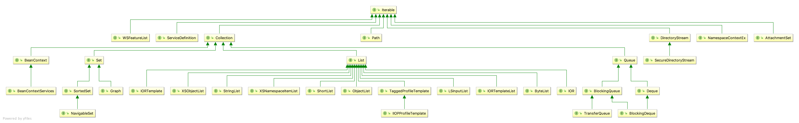

# 概览

Iterable在rt.jar中的接口结构如图:

## 1 WSFeatureList

> 当前此接口作用未知

## 2 AttachmentSet

> 当前此接口作用未知

## 3 DirectoryStream

用于遍历目录

### 3.1 SecureDirectoryStream

> 一个{@code DirectoryStream}用于定义相对于打开目录的文件的操作。 {@code SecureDirectoryStream}旨在供复杂或安全敏感的应用程序使用，这些应用程序需要遍历文件树或以无竞争的方式对目录进行操作。当一系列文件操作无法单独执行时，可能会出现条件。此接口定义的每个文件操作都指定相对路径。无论在目录打开时目录是否被攻击者移动或替换，对文件的所有访问都与打开目录相关。

### 4 NamespaceContextEx

> 用于只读XML命名空间上下文处理的接口。

### 5 Collection

> * 集合类的根接口。 集合表示一组对象，称为元素。 有些集合允许重复元素而其他集合则不允许。 有些是有序的，有些是无序的。 JDK不提供此接口的任何直接实现：它提供了更具体的子接口的实现，如 Set和List。 此接口通常用于传递集合并在需要最大通用性的情况下对其进行操作。  
> * Bags 或 multisets（可能包含重复元素的无序集合）应直接实现此接口。  
> * 所有通用Collection实现类（通常通过其一个子接口间接实现Collection）应提供两个“标准”构造函数：void（无参数） 构造函数，它创建一个空集合，以及一个构造函数，其单个参数类型为 Collection，它创建一个与其参数具有相同元素的新集合。 实际上，后一个构造函数允许用户复制任何集合，从而生成所需实现类型的等效集合。 没有办法强制执行此约定（因为接口不能包含构造函数），但Java平台库中的所有通用Collection实现都符合。  
> * 集合可能会抛出 "UnsupportedOperationException"异常
> * 有些集合不允许插入空对象，但是有些可以插入

### 6 Path

> 可用于在文件系统中查找文件的对象。 它通常表示系统相关的文件路径。

### 7 当前此接口作用未知